# QDArchive Pipeline Architecture

```mermaid
flowchart LR
    subgraph P1["Phase 1 — Ingestion and project selection"]
        A[Student metadata databases]
        B[Schema normalization]
        C[(Combined SQLite database)]
        D[Rule-based project-type classification]
        E[QDA_PROJECT and QD_PROJECT selection]

        A --> B --> C --> D --> E
    end

    subgraph P2["Phase 2 — ISIC classification and evaluation"]
        F[Model-input preparation]
        G[ISIC Rev. 5 taxonomy<br/>87 divisions]
        H[ISIC Classification Engine]
        H1[GPT-4o-mini]
        H2[GPT-4.1-mini]
        I[Structured Output and ISIC Validation]
        J1[Retry Handling]
        J2[Cross-Model Resume Filtering]
        K[(project_classifications)]
        L[Integrity validation]
        M[Evaluation Reports]
        N1[(Final SQLite database)]
        N2[Evaluation CSV reports]
        N3[XLSX results export]
        N4[PDF report]

        F --> H
        G --> H
        H --> H1
        H --> H2
        H1 --> I
        H2 --> I
        I --> J1 --> J2 --> K

        K --> L
        K --> M
        K --> N1
        M --> N2
        M --> N3
        M --> N4
    end

    E --> F
```

Phase 1 ingests and normalizes the per-student metadata databases into a single combined SQLite database. A deterministic rule-based classifier then assigns project types and selects QDA_PROJECT and QD_PROJECT records for downstream processing.

Phase 2 prepares model-ready project metadata, combines it with the 87-division ISIC Rev. 5 taxonomy, and sends it to the ISIC Classification Engine using GPT-4o-mini or GPT-4.1-mini. Structured responses are validated against both the JSON schema and the ISIC taxonomy. Retry handling addresses transient API failures, while cross-model resume filtering prevents already completed projects from being reclassified.

Validated results are stored in the project_classifications SQLite table and used for integrity checks, statistical evaluation, and the final SQLite, CSV, XLSX, and PDF deliverables.
